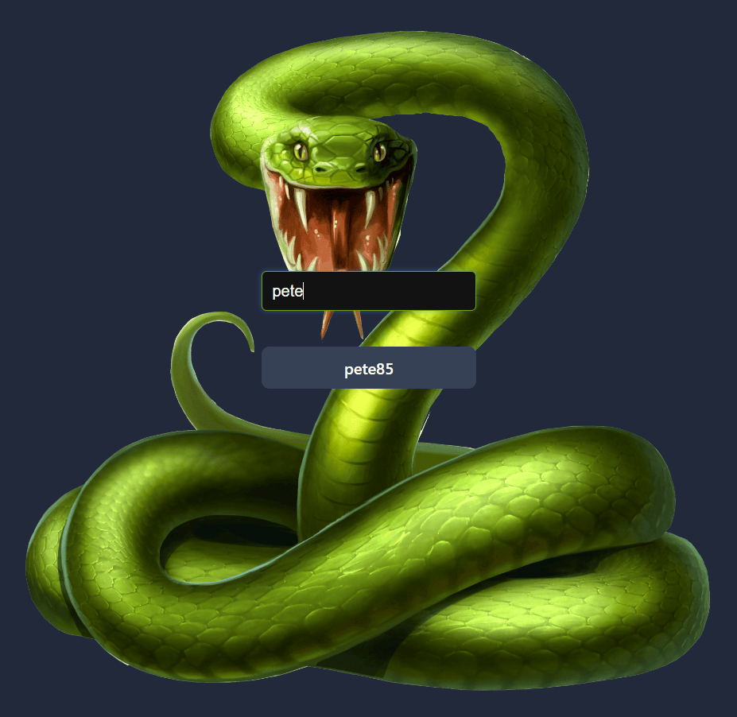
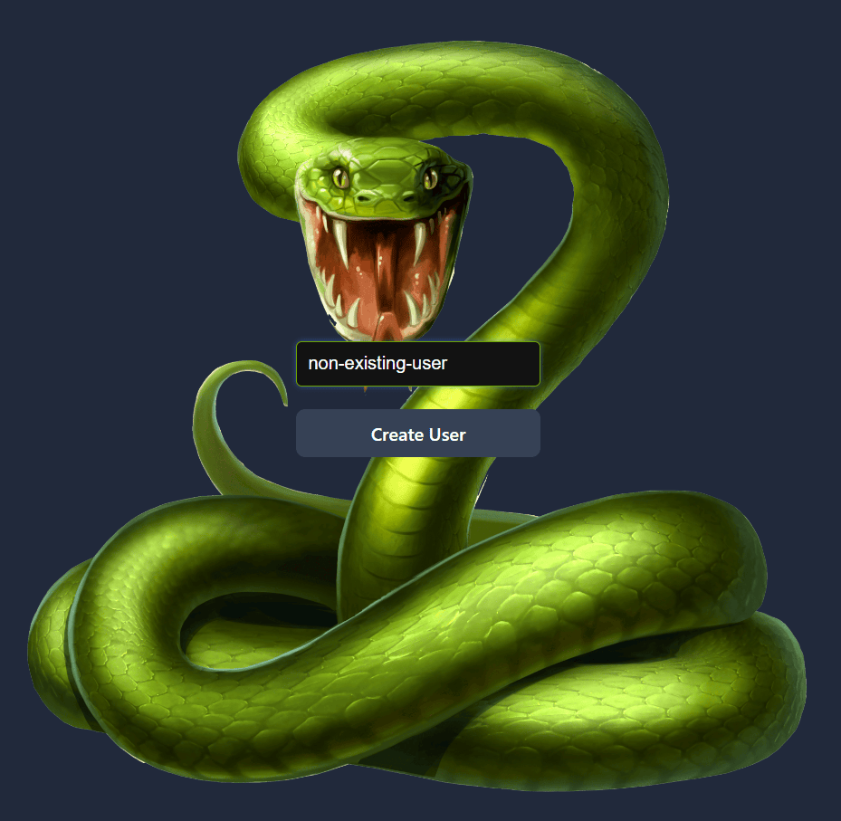

# Snake Game Project

This Snake Game project is a modern take on the classic game built using the following technologies:

- React for UI development, handling components and state.
- Vite as the build tool, providing fast development and optimized builds.
- TypeScript to enable strong typing, improving maintainability and reducing runtime errors.
- Tailwind CSS for responsive and customizable styling.
- Axios for handling HTTP requests to a back-end server.
- Node.js & Express to serve the back-end API.
- MongoDB as the database for user data and scores.

## Game Overview

This Snake Game features a user management system, dynamic game mechanics, 
and score tracking. Each user can save their highest score, and the top scores are 
viewable on the scoreboard.

## Instructions

### Selecting / Creating a User

#### Selecting a User:

On the home screen, you’ll see a search bar where you can type a partial or full username.
The app will show matching users based on the search. Select a user by clicking on their name, which will take you to the game screen.

#### Creating a New User:

If the desired username doesn’t exist, create a new user by typing a unique name and clicking the "Create User" button.
This will add the user to the database and navigate to the game screen.

### How to Play the Game

#### Movement:

Use the arrow keys (Up, Down, Left, Right) to control the snake's direction.

#### Objective:

The objective is to eat as much food as possible to grow the snake and achieve the highest score.
Each piece of food increases the snake’s length and score. The game will track your current score and display it in real-time.
Types of Food and Their Effects

#### Standard Food:

Appearance: Regularly spawns throughout the game.
Effect: Increases the snake’s length by 1 unit and adds 1 point to the score.

#### Special Food (e.g., Bonus Food):

Appearance: Randomly appears at intervals or under specific conditions, such as after a certain score threshold or a random timer.
Effect: Increases the snake’s length by 1 unit and provides a larger score boost (3 points).
Expiration: Special foods may disappear if not eaten within a few seconds, adding a challenge for the player.

### Highest Scores

#### Tracking High Scores:

After each game, the score is compared against the user's highest score. If the current score exceeds the highest score, it is updated in the database.

#### Top Scoreboard:

The top scores of all players are displayed in a scoreboard, which refreshes after each game.
The scoreboard ranks users based on their highest scores, with ties broken by the most recent score update.

### Switching Users

To switch to a different user, click the "Switch User" button in the game, which resets the game, clears the current user, and navigates back to the home screen.

## Game Logic Highlights

### Dynamic Food Generation: 
Foods appear at random locations and specific intervals, with special foods appearing less frequently or based on certain triggers.

### Score Management: 

Each food type contributes differently to the score, and scores update both in real-time and at the end of the game.

### Data Persistence: 

User information and high scores are stored in MongoDB, ensuring that scores are retained across sessions.

This project provides an enjoyable, interactive experience with a familiar game, enhanced by modern web development practices and user personalization.